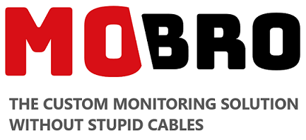
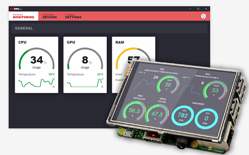

# mobro-raspberrypi

**Official Raspberry Pi image of MoBro**
  

## What is MoBro?

The Monitor Bro (MoBro) collects monitoring data about your installed hardware locally on your PC.  
It is designed and built to take in monitoring data from multiple different monitoring applications 
(= data sources) such as HWiNFO and others.  
It combines them into a single UI while letting you choose which values of which source you are interested in and want to see.  
All configurable via an easy customization interface. 

__Defining features__:
* Reading data from different sources
* Customizable interface displaying the data YOU are interested in
* Your data does not leave your network and is shared with no one
* Displaying data on various mobile devices located anywhere in your house
* Different themes for each of your devices

## Windows application

The running MoBro desktop application is required for this Raspberry Pi project.  
Currently only available for Windows.

[Download](https://www.mod-bros.com/en/projects/mobro)

## Raspberry Pi image

This Raspberry Pi image acts as a client device to the MoBro Windows application to which it connects.  
It provides an easy and cost effective way to set up a wireless device displaying the PC's stats in realtime anywhere in the house.

### What does this image do?

This custom pre-configured image provides an easy way to setup the Raspberry Pi as a MoBro monitoring device.  
It is ready to be flashed onto a micro SD card and put straight to use in a Raspberry Pi.   
All the required configuration is done via an easy web based configuration wizard. 

No coding skills or Linux experience required. 

### Supported Raspberry Pi Models

This image is ready to run on all Raspberry Pi models.  
For wireless operation a model with built-in Wifi is required.

[Supported models and known limitations](https://www.mod-bros.com/en/faq/mobro/raspberry/supported-hardware)

### Download and install

Detailed instructions on how to download flash and setup the image can be found here:
[Download and flash](https://www.mod-bros.com/en/faq/mobro/raspberry/download), 
[Setup](https://www.mod-bros.com/en/faq/mobro/raspberry/setup)

## Planned further development

Major features planned for future development:

### USB Gadget Mode  
Make use of USB gadget mode and RNDIS on windows to enable the use of the Raspberry Pi via a single USB cable for power and data.  
Would require no Wifi setup or ethernet cable.

[GITHUB: USB gadget mode enabled in the image to allow single wire connection to machine](https://github.com/ModBros/mobro-raspberrypi/issues/1)  
[FORUM: Using RNDIS/Ethernet to connect Raspberry Pi Zero to computer network](https://www.mod-bros.com/en/forum/t/using-rndis-ethernet-to-connect-raspberry-pi-zero-to-computer-network~926)

### Screensaver / Turn off screen  
If the Pi doesn't power down when the PC is shut down, the display stays on an the Pi periodically tries to reconnect ot the PC.  
We could add a setting the display some sort of screensaver in this case.  
Or turn off the display completely (if possible).

[FORUM: New Feature Request - Screensaver/Powersave Mode](https://www.mod-bros.com/en/forum/t/new-feature-request-screensaver-powersave-mode~854)

### Automatic updatability

Updating currently requires the SD card to be flashed again with the new image. This is not ideal.
Enable automatic update or at least manually triggered update via configuration page or rest endpoint.  

### OverlayFS  
Make use of [OverlayFS](https://www.datalight.com/blog/2016/01/27/explaining-overlayfs-%E2%80%93-what-it-does-and-how-it-works/) 
for the MoBro Raspberry Pi image to prevent SD card corruption.  
Especially relevant if the Raspberry Pi isn't able to perform clean shutdowns.  
E.g.: It is directly connected to and powered by the motherboard and therefore just looses power whenever the PC 
is shut down.
