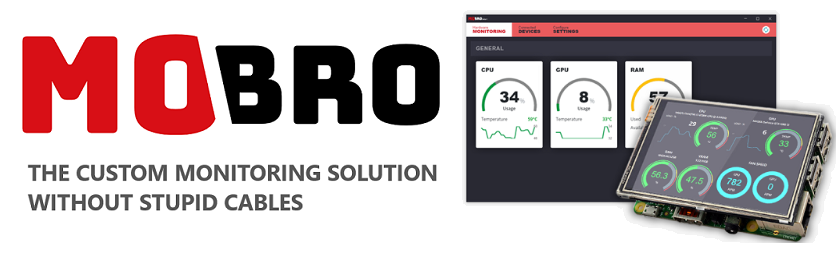

# mobro-raspberrypi


[](https://www.mod-bros.com/en/projects/mobro)
[](https://www.mod-bros.com/en/faq/mobro)
[](https://www.youtube.com/watch?v=iebBcQuBhYs)

**Official Raspberry Pi image of MoBro**
  


### Table of Contents
   * [What is MoBro?](#what-is-mobro)
   * [Windows application](#windows-application)
   * [Raspberry Pi image](#raspberry-pi-image)
      * [What does this image do?](#what-does-this-image-do)
      * [Download and install](#download-and-install)
      * [Supported Raspberry Pi Models](#supported-raspberry-pi-models)
   * [Planned features](#planned-features)
   * [Developer documentation](#developer-documentation)

## What is MoBro?

The Monitor Bro (MoBro) collects monitoring data about your installed hardware locally on your PC.  
It is designed and built to take in monitoring data from multiple different monitoring applications 
(= data sources) such as HWiNFO and others.  
It combines them into a single UI while letting you choose which values of which source you are interested in and want to see.  
All configurable via an easy customization interface. 

__Defining features__:
* Reading data from different sources
* Customizable interface displaying the data YOU are interested in
* Your data does not leave your network and is shared with no one
* Displaying data on various mobile devices located anywhere in your house
* Different themes for each of your devices

## Windows application

This Raspberry Pi project requires the running MoBro desktop application.  
The running MoBro desktop application is required for this Raspberry Pi project.  
Currently only available for Windows.

[Download](https://www.mod-bros.com/en/projects/mobro)

## Raspberry Pi image

This Raspberry Pi image acts as a client device to the MoBro Windows application to which it connects.  
It provides an easy and cost effective way to set up a wireless device displaying the PC's stats in realtime anywhere in the house.

[](http://www.youtube.com/watch?v=iebBcQuBhYs)

### What does this image do?

This custom pre-configured image provides an easy way to setup the Raspberry Pi as a MoBro monitoring device.  
It is ready to be flashed onto a micro SD card and put straight to use in a Raspberry Pi.   
All the required configuration is done via an easy web based configuration wizard. 

No coding skills or Linux experience required. 

### Download and install

Detailed instructions on how to download flash and setup the image can be found here:  
[Download and flash](https://www.mod-bros.com/en/faq/mobro/raspberry/download), 
[Setup](https://www.mod-bros.com/en/faq/mobro/raspberry/setup)

### Supported Raspberry Pi Models

This image is ready to run on all Raspberry Pi models.  
For wireless operation a model with built-in Wifi is required.

[Supported models and known limitations](https://www.mod-bros.com/en/faq/mobro/raspberry/supported-hardware)

## Planned features

Ideas, feedback or feature suggestions are always welcome.  
These are the major features that we planned so far:

- [ ] [USB Gadget Mode](https://github.com/ModBros/mobro-raspberrypi/issues/1)
- [x] [Screensaver](https://github.com/ModBros/mobro-raspberrypi/issues/2)
- [x] [Screen rotation / orientation](https://github.com/ModBros/mobro-raspberrypi/issues/3)
- [ ] [Automatic updatability](https://github.com/ModBros/mobro-raspberrypi/issues/4)
- [ ] [OverlayFS](https://github.com/ModBros/mobro-raspberrypi/issues/5)


## Developer documentation

### REST API

For debug purposes the MoBro Raspberry Pi image exposes a very basic REST API.  
This API is subject to change.

|     | Route              | Description                                                                | Parameters |
| --- | :----------------- | :------------------------------------------------------------------------- | :--------- |
| GET | /version           | returns the current version number                                         | *lines*: only most recent n lines<br> *count*: log files of previous n boots (max = 10, default = 0) |
| GET | /log               | returns the current logfile (from this boot)                               | - |
| GET | /api               | returns the API documentation                                              | - |
| GET | /api/temperature   | returns the current CPU temperature                                        | - |
| GET | /api/top           | returns the output of the "top" command. i.e.: CPU/RAM Usage, Processes... | - |
| PUT | /api/restart       | restarts the Raspberry Pi                                                  | *delay*: minutes before restart (default = 0) |
| PUT | /api/shutdown      | shuts down the Raspberry Pi                                                | *delay*: minutes before shutdown (default = 0) |
| PUT | /api/service       | starts, stops or restarts the MoBro service                                | *action*: start, stop, restart (default) |
| GET | /api/configuration | returns the current configuration                                          | - |


#### Configuration format

The MoBro specific configuration is stored as a simple property file.  
All current settings and their meaning:

| Setting               | Description |
| :-------------------- | :---------- |
| localization_country  | [ISO 3166 country code](https://en.wikipedia.org/wiki/List_of_ISO_3166_country_codes) |
| localization_timezone | timezone name as listed in [TZ database](https://en.wikipedia.org/wiki/List_of_tz_database_time_zones) |
| network_mode          | 'eth' or 'wifi' |
| network_ssid          | the network SSID to connect to (only in wifi mode) |
| network_pw            | the network password (only in wifi mode) |
| network_wpa           | the WPA mode. one of: 2a, 2t, 1t, n (optional, only in wifi) |
| network_hidden        | whether the network is hidden (only in wifi) |
| discovery_mode        | 'auto' (default) or 'manual'|
| discovery_key         | the discovery key as configured in the MoBro deskop application (default=mobro) |
| discovery_ip          | the static IP address of the PC (only in 'manual' network mode) |
| display_driver        | 'hdmi', 'manual' or path to the driver install executable |
| display_rotation      | one of: 0 (default), 90, 180, 270 |
| display_screensaver   | 'disabled' or screensaver file |
| display_delay         | delay for the screensaver in minutes, default=5 |

Just altering the values in the configuration file is NOT enough.  
The configuration file has to be applied by executing the [apply_new_config.sh](./scripts/apply_new_config.sh) script and passing the config file as parameter.

Example configuration:
```
localization_country=AT
localization_timezone=Europe/Vienna
network_mode=eth
network_ssid=
network_pw=
network_wpa=
network_hidden=0
discovery_mode=auto
discovery_key=mobro
discovery_ip=
display_driver=hdmi
display_rotation=0
display_screensaver=clock_date.php
display_delay=0
```